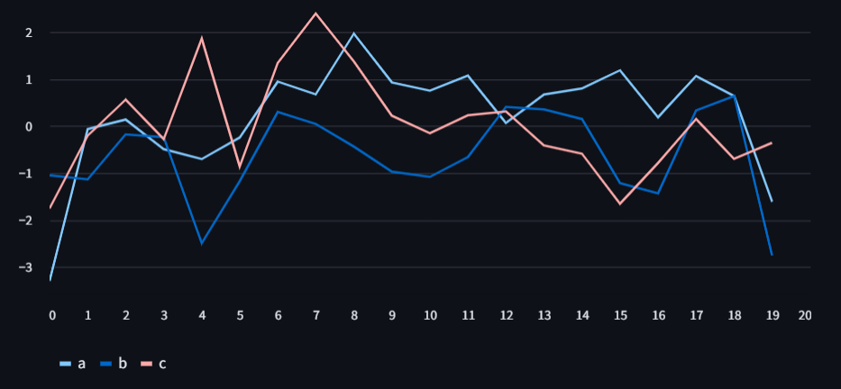

# 🚀 Getting Started with Streamlit

Streamlit is an open-source Python framework that lets you turn Python scripts into interactive web apps — **fast**. It’s great for data science demos, dashboards, and experiments because it requires no web development experience. If you know Python, you can build an app!

In this post, we'll walk through a simple Streamlit app step-by-step.

---

## 🏷️ Setting Up Streamlit and Your App Title

```python
import streamlit as st
import numpy as np
import pandas as pd

st.title("Hello Streamlit")
```
➡️ We import the required libraries — streamlit, numpy, and pandas. Then, st.title() adds a big title to the app's UI.

output:


## 💬 Displaying Text
```python
st.write("This is simple text")
```
➡️ st.write() is a very flexible function — it can display strings, numbers, dataframes, and even charts.

output:


## 📊 Creating and Showing a DataFrame
```python
df = pd.DataFrame({
    'first column': [1, 2, 3, 4],
    'second column': [10, 20, 30, 40]
})

st.write("Here is the dataframe")
st.write(df)
```
➡️ We create a simple pandas DataFrame and display it using st.write(). Streamlit renders it as an interactive table.


output:


##📈 Creating a Line Chart
```python
chart_data = pd.DataFrame(
    np.random.randn(20, 3),
    columns=['a', 'b', 'c']
)

st.line_chart(chart_data)
```
➡️ This part creates a random DataFrame and visualizes it with a line chart. Streamlit automatically makes it interactive.

output:



## To run your streamlit code :
 Go to terminal and type : streamlit run <file_name.py>


(more topics coming soon! 🧩)

